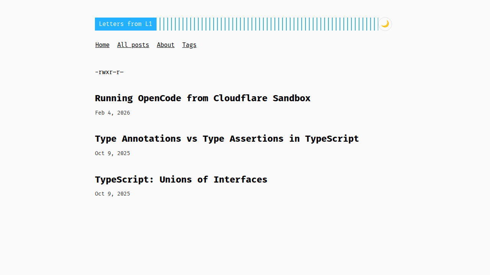
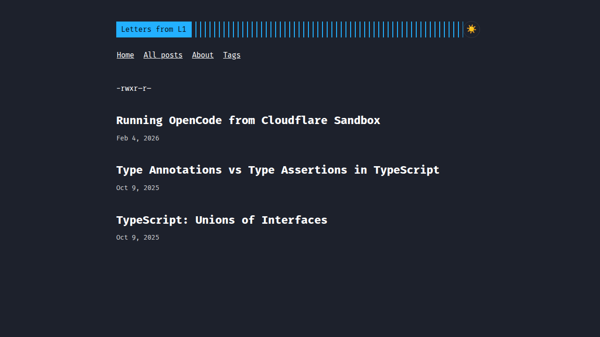

# Personal Blog

A personal blog built with [Hugo](https://gohugo.io/) and hosted on [GitHub Pages](https://pages.github.com/).

## 🚀 Quick Start

### Prerequisites

- [Hugo](https://gohugo.io/installation/) (v0.139.4 or later)
- [Git](https://git-scm.com/)

### Local Development

1. Clone the repository:
   ```bash
   git clone https://github.com/<username>/personal-blog.git
   cd personal-blog
   ```

2. Initialize and update submodules (for the theme):
   ```bash
   git submodule update --init --recursive
   ```

3. Start the development server:
   ```bash
   hugo server -D
   ```

4. Open your browser and navigate to `http://localhost:1313`

### Creating Content

Create a new blog post:
```bash
hugo new content posts/my-new-post.md
```

### Building

Build the site for production:
```bash
hugo --minify
```

The built site will be in the `public/` directory.

## 📁 Project Structure

```
personal-blog/
├── archetypes/       # Content templates
├── assets/           # Assets processed by Hugo
├── content/          # Site content (blog posts, pages)
├── data/             # Data files
├── layouts/          # HTML templates
├── static/           # Static files (images, CSS, JS)
├── themes/           # Hugo themes
├── hugo.toml         # Site configuration
└── README.md         # This file
```

## 🎨 Theme

This blog uses the [Archie](https://github.com/athul/archie) theme.

## 📸 Screenshots

### Light mode


### Dark mode


## 🌐 Deployment

The site is automatically deployed to GitHub Pages when you push to the `main` branch. See `.github/workflows/hugo.yml` for the deployment configuration.

### Manual Deployment to GitHub Pages

1. Push to GitHub:
   ```bash
   git push -u origin main
   ```

2. Enable GitHub Pages in your repository settings:
   - Go to Settings → Pages
   - Source: Deploy from a branch
   - Branch: gh-pages (created automatically by the workflow)

3. Your site will be available at `https://<username>.github.io/personal-blog/`

## 📝 Configuration

Edit `hugo.toml` to customize:
- Site title and description
- Author information
- Social links
- Menu items
- Theme parameters

Don't forget to update:
- `<username>` in the baseURL with your GitHub username
- Author name and description
- Social media links

## 📄 License

This project is open source and available under the [MIT License](LICENSE).

## 🙏 Credits

- [Hugo](https://gohugo.io/) - The world's fastest framework for building websites
- [PaperMod](https://github.com/adityatelange/hugo-PaperMod) - A fast, clean, responsive Hugo theme
- [GitHub Pages](https://pages.github.com/) - Free hosting for static sites
